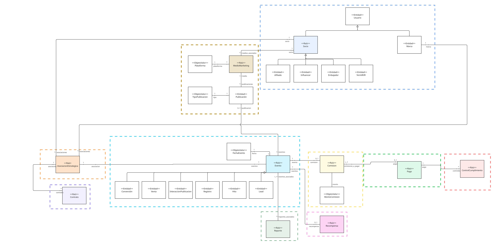

# Entrega 3 - Implementación

## 👥 Integrantes - Reactive Builders

| Nombre | Correo |
| :--- | :--- |
| Orlando Giovanny Solarte Delgado | o.solarte@uniandes.edu.co |
| Martín Flores Arango | r.floresa@uniandes.edu.co |
| Sara Sofía Cárdenas Rodríguez | ss.cardenas@uniandes.edu.co |
| Daniel Felipe Díaz Moreno | d.diazm@uniandes.edu.co |

## Estructura del proyecto

Se basa en la estructura del Tutorial 5 - CQRS y manejo de eventos, pero adaptado a Alpes Partners

En particular, se encuentran los archivos `requirements.txt`, `docker-compose.yml.txt`, `Reactive Builders.postman_collection.json`y los Dockerfiles necesarios.

El código se encuenta en la carpeta `src/alpespartners`, con la carpeta `api` y sus dos correspondientes módulos (`eventos_medios` y `comision_recompensa`). Cada módulo guarda la separación de capa de aplicación, dominio e infraestructura.

## Arquitectura

Se decidió implementar el microservicio de Eventos y Atribución, relacionado con el tracking y procesamiento de eventos.

Para propósitos de implementación, las agregaciones involucradas no cambiaron en el modelo de dominio respecto a la entrega anterior. Puede verse en la imagen `Dominio.jpg`, donde solo se detallan las agregaciones involucradas, dejando el resto con su entidad raíz solamente.



En particular, se implementaron las siguientes agregaciones en los módulos a continuación:

**Conexiones externas para el tracking de eventos** (módulo `eventos_medios`): Contiene las agregaciones Medios de Marketing (color ocre) y Eventos (color azul claro)

**Atribución de eventos** (módulo `comision_recompensa`): Contiene las agregaciones Comisión (color amarillo) y Recompensas (color rosa)

## Pasos de ejecución

El proyecto está pensado para su ejecución de forma local. Por lo tanto, clone el repositorio primero.

### Inicializar el proyecto

**1.** Crear el entorno virtual

```bash
python -m venv venv

# Si el launcher es py en vez de python
py -m venv venv
```

**2.** Activar el entorno virtual

- En **Linux / macOS**:

```bash
source venv/bin/activate
```

- En **Windows PowerShell**:

```powershell
venv\Scripts\Activate.ps1
```

- En **Windows CMD**:

```cmd
venv\Scripts\activate.bat
```

**3.** Instalar las dependencias

```bash
pip install -r requirements.txt
```

### Crear base de datos Postgres

1. Se crea la base de datos con Docker Compose

```bash
docker-compose --profile db up
```

2. Puede conectarse a la base de datos con los siguientes parámetros:

**Host:** 127.0.0.1 (localhost)

**Port:** 5433

**Database:** aeroalpes

**Username:** admin

**Password:** admin

Para esto, puede usar extensiones de VS Code como Database Client, que también permiten visualizar las tablas.

### Ejecutar Aplicación

Desde el directorio principal ejecute el siguiente comando.

```
flask --app src/alpespartners/api run
```

Siempre puede ejecutarlo en modo DEBUG:

```
flask --app src/alpespartners/api --debug run
```

## Hacer requests

Se pueden hacer los POSTs y GETs respectivos utilizando el archivo `Reactive Builders.postman_collection.json` ubicado en el directorio principal.

> **Nota:** Debe ser cuidadoso con el envio de ids y llaves foráneas en los bodies de las requests, con el fin de referenciar objetos realmente persistidos, ya que se usan UUIDs que por definición son cambiantes entre ejecuciones.

Estos son los endpoints usados para la demostración de la arquitectura basada en eventos:

- **Crear medio marketing:** Registra un medio de marketing, es decir, una cuenta de red social un influencer, una página web de un afiliado tradicional, entre otros. Esto es necesario para asociar su contenido.

    POST `/medios_marketing/medio-comando`

- **Crear publicación:** Registra una publicación, es decir, un post de un influencer, un artículo web de un afiliado tradicional, entre otros. Esto es necesario para asociar su tracking relacionado.

    POST `/medios_marketing/publicacion-comando`

- **Crear evento de tracking:** Registra un evento de tracking invocado desde el servicio externo vigilado. Por ejemplo, en un caso simple, podrían ser pixeles que usan un GET, pero se prefirió usar POST por semántica de creación.

    POST `/eventos/evento-comando`

    En Postman, se tienen dos ejemplos:

    - Registra un lead, por ejemplo, de un embajador, socio B2B o integrador SaaS.

    - Registra una interacción con una publicación de un influencer o creador de contenido

Los siguientes endpoints corresponden a pruebas sobre la aplicación adicionales, fuera de la demostración:

- **Healthcheck:** Verifica si la aplicación está arriba

    GET `/health`

- **Crear recompensa:** Las recompensas se asocian a los influencers, creadores de contenido y embajadores luego de eventos (por ejemplo, leads) que cumplen las condiciones de atribución.

    POST `/prueba/recompensa-comando`

- **Crear comisión:**  Las comisiones se asocian a los afiliados y a los socios en general luego de eventos (por ejemplo, interacciones con publicaciones de afiliados) que cumplen las condiciones de atribución.

    POST `/prueba/comision-comando`

## Video de la ejecución

Se encuentra en el directorio principal, con el nombre `video.mp4`